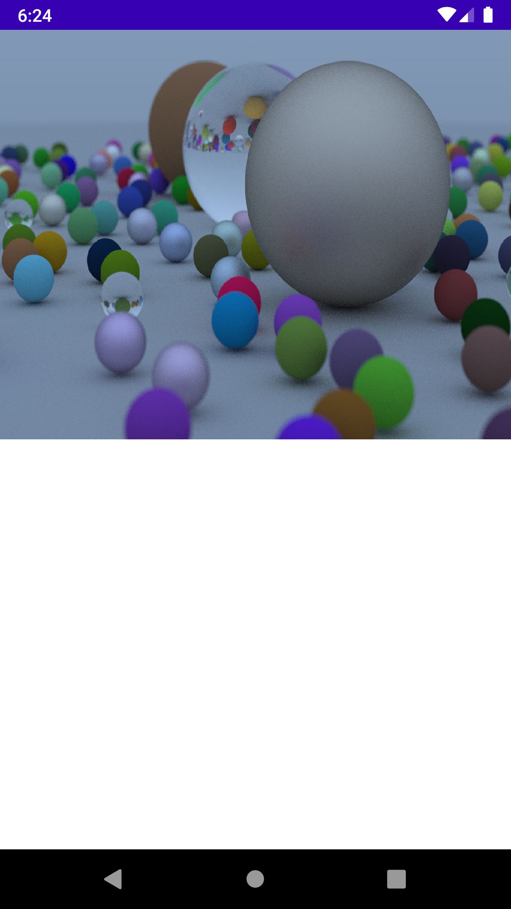

## About
Android raytracer implemented using a custom view for rendering. The main inspiration for most of the concepts and code came from the book [_Ray Tracing in One Weekend_](https://raytracing.github.io/books/RayTracingInOneWeekend.html). 

## Overview
The raytracer currently runs on a single thread, and the only available model is a sphere with a selection of three materials to render from: glass, metal, and lambert.

## Demo

## TODO
* Multithreading 
* I/O with obj files and texture
* Different types of lights and materials 

## Sources

[_Ray Tracing in One Weekend_](https://raytracing.github.io/books/RayTracingInOneWeekend.html)
